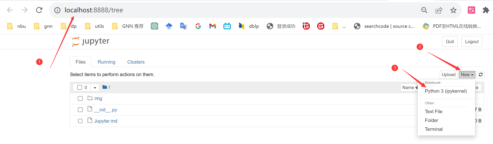

# Jupyter 的使用

https://zhuanlan.zhihu.com/p/75402607

### 1.安装

- conda安装：`conda install jupyter`
- pip安装：`pip install jupyter`

### 2.启动Jupyter Notebook
直接在cmd里面进入要创建notebook的目录运行：`jupyter notebook`，来启动一个Jupyter

### 3.创建Jupyter
对应文件的扩展名为：*.ipynb。
每个 ipynb 文件都是通过 JSON 格式来描述 notebook 的内容，包括每个单元及其内容，都是通过 metadata 的格式展示。

### 1.

### 1.

