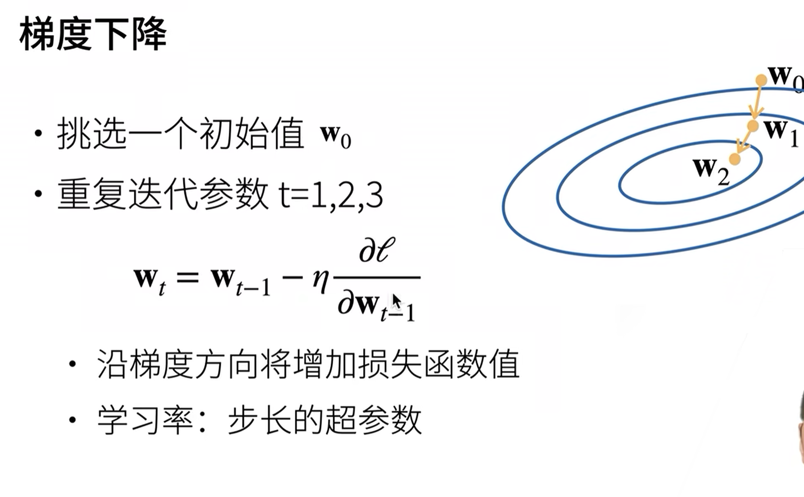
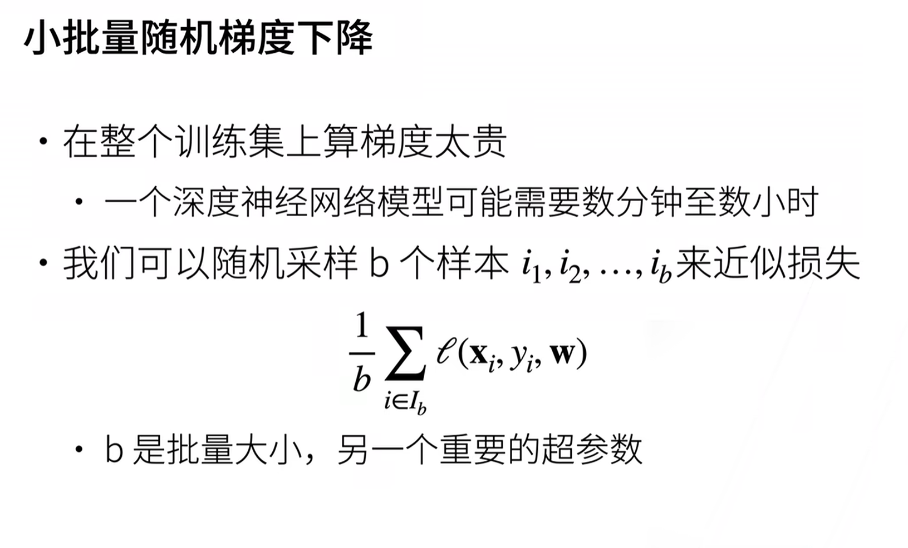

# deep learning hyperparameters 深度学习 超参数

## 1. 学习率 η
   - 学习率（Learning Rate）: 控制模型参数在每次迭代更新时的步长大小。
   - 梯度下降前面的那个参数 η

## 2. 批量大小
   - 批量大小（Batch Size）: 每次迭代中用于更新模型的样本数量。
   - 每次梯度传播过程中取多少样本来计算这次的梯度

## 3. 
   - 批量大小（Batch Size）: 每次迭代中用于更新模型的样本数量。
   - 每次梯度传播过程中取多少样本来计算这次的梯度

z

迭代次数（Epochs）: 定义整个训练数据集被遍历的次数。
优化器参数（Optimizer Parameters）: 如动量、权重衰减等。
正则化参数（Regularization Parameters）: 控制模型复杂度的参数，如 L1、L2 正则化的权重。
网络结构相关的超参数（Network Architecture-related Hyperparameters）: 如层数、每层的节点数、激活函数等。
Dropout 概率（Dropout Probability）: 在训练过程中随机丢弃神经元的概率。
学习率衰减（Learning Rate Decay）: 控制学习率随着训练步骤递减的速率。
初始化参数（Initialization Parameters）: 设置权重初始化的策略。